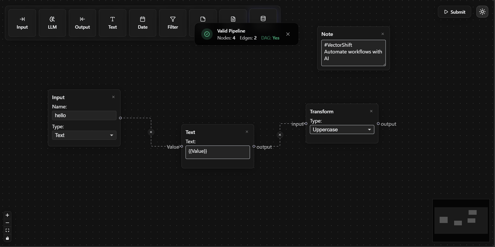

# VectorShift Frontend Technical Assessment

A pipeline builder featuring a robust node abstraction system, on-demand DAG validation, and a responsive Glassmorphism UI with persistent theming.




## 🚀 Key Features

### 🎨 Product Engineering & UX

- **Glassmorphism UI:** A modern, high-end aesthetic using semi-transparent layers and subtle glows.

- **System-Aware Dark Mode:** Automatically syncs with OS preferences and persists user choice via `localStorage`.

- **Floating Toolbar:** A responsive, scrollable toolbar that adapts to mobile and desktop layouts.

- **Interactive MiniMap:** Context-aware navigation that syncs with the active theme.

- **Custom Notification System:** Replaced native alerts with a custom, animated notification banner for success/error/empty states.

### 🏗️ Technical Architecture

- **Scalable Node Abstraction (`BaseNode`):** Decoupled logic from layout, allowing rapid creation of 5 new example node types without code duplication.

- **Advanced Text Node:** Features auto-resizing text areas and **Regex-based variable extraction** (e.g., `{{input}}` spawns a handle).

- **Graph Algorithms:** Backend integration using `NetworkX` to perform **Directed Acyclic Graph (DAG)** validation on pipeline submission.

- **Custom Edge Logic:** Interactive edges with a centered "Delete" button for rapid prototyping.

---

## 🛠️ Tech Stack

**Frontend:**

- React.js (Create React App)

- React Flow (v11)

- Zustand (State Management)

- Lucide React (Iconography)

- CSS Variables (Theming Engine)

**Backend:**

- Python 3.x

- FastAPI

- NetworkX (Graph Logic)

- Pydantic (Data Validation)

---

## ⚡ Getting Started

### Prerequisites

- Node.js (v16+)

- Python (v3.8+)

- pip

### 1. Backend Setup (FastAPI)

The backend handles pipeline parsing and DAG validation.

```bash
cd backend

# Create virtual environment (Optional but recommended)
python -m venv venv
# Windows:
.\venv\Scripts\activate
# Mac/Linux:
source venv/bin/activate

# Install dependencies
pip install fastapi uvicorn networkx python-multipart

# Start the server
uvicorn main:app --reload
```

*Server runs on: `http://127.0.0.1:8000`*

### 2. Frontend Setup (React)

The frontend provides the interactive canvas and node management.

```bash
cd frontend

# Install dependencies
npm install

# Start the development server
npm start
```

*App runs on: `http://localhost:3000`*

-----

## 🧪 How to Test

### 1. DAG Validation Logic

1.  Create three nodes: `Input` -> `LLM` -> `Output`.

2.  Connect them in a linear flow.

3.  Click **Submit**.
      * *Result:* ✅ "Valid Pipeline" (Is DAG: True).

4.  Create a loop by connecting `Output` back to `Input`.

5.  Click **Submit**.
      * *Result:* ❌ "Cycle Detected" (Is DAG: False).

### 2. Variable Extraction (Text Node)

1.  Drag a **Text Node** to the canvas.

2.  Type: `Hello {{customer_name}}, your order {{order_id}} is ready.`

3.  Observe that two new handles labeled `customer_name` and `order_id` appear instantly on the left.

4.  Resize the text; the node grows automatically.

### 3. Theme System

1.  Click the **Sun/Moon icon** in the top-right.

2.  Observe the instant transition of:
      * Node backgrounds (White -> Dark Glass).
      * MiniMap colors.
      * Toolbar and draggable icons.

3.  Refresh the page; the preference persists.

-----

## 📂 Project Structure

```
├── backend/
│   ├── main.py            # FastAPI entry point & DAG logic
│
├── frontend/
│   ├── src/
│   │   ├── nodes/         # Node Components
│   │   │   ├── BaseNode.js    # Core Abstraction Wrapper
│   │   │   ├── inputNode.js   # Input node
│   │   │   ├── outputNode.js  # Output node
│   │   │   ├── textNode.js    # Regex & Resizing Logic
│   │   │   ├── llmNode.js     # LLM node
│   │   │   └── exampleNodes.js # 5 example nodes (Date, Filter, Note, Transform, Database)
│   │   ├── edges/         # Custom Edges
│   │   │   └── ButtonEdge.js  # Edge with Delete Button
│   │   ├── ui.js          # UI Components (Alerts, ThemeToggle, PipelineUI)
│   │   ├── toolbar.js     # Floating Draggable Toolbar
│   │   ├── draggableNode.js # Draggable node component for toolbar
│   │   ├── submit.js      # Backend Integration Logic
│   │   ├── store.js       # Zustand Store & React Flow Hooks
│   │   ├── App.js         # Root component
│   │   └── index.css      # Global styles & theme variables
```

-----

Submitted by Shaik Raiyan


